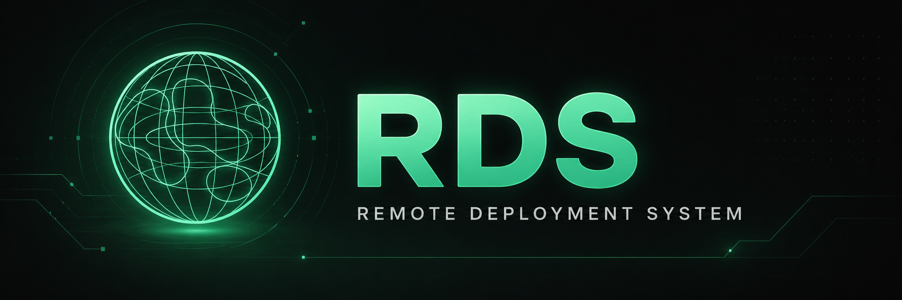
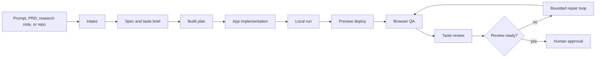

# RDS

[](https://github.com/chrissotraidis/RDS/actions/workflows/public-checks.yml)



**Remote Deployment System** is a self-hosted build workshop for turning a
brief, PRD, research note, or existing repository into a running app with
evidence you can inspect.

RDS is built for a dedicated VPS or personal cloud computer: one trusted
operator, one durable machine, persistent build state, public previews, and
explicit human approval before anything is treated as done.

It is not a SaaS CI product. It is closer to an AI-native workshop bench:
drop in intent, let the system plan/build/test/deploy, then use the dashboard
to inspect what happened and decide what should happen next.

## What RDS Does



RDS gives you a repeatable loop for agent-assisted app builds:

```text
input -> spec -> build plan -> implementation -> local run
      -> preview deploy -> QA -> taste review -> repair loop -> approval
```

It keeps the receipts:

| Evidence | Where it shows up |
|---|---|
| Source input and generated spec | build folder, dashboard build detail |
| Build plan and selected stack/skills | `state.json`, build plan, dashboard |
| Terminal logs and model-worker output | per-stage logs and live terminal view |
| Browser QA, screenshots, and verdicts | QA artifacts and dashboard tabs |
| Preview URL and deploy metadata | `preview-url.txt`, service metadata |
| Review, chat, and action history | dashboard state and chat records |

A build is not just "the agent says it worked." A build has a folder of
evidence and a dashboard surface for deciding whether it is actually good
enough.

## What You Can Build

RDS supports two main paths.

| Path | Start With | RDS Produces |
|---|---|---|
| Green-field | Research doc, PRD, uploaded source, or raw product prompt | A generated app plus build evidence |
| Brown-field | Existing repository plus a PRD/change request | A modified repo/app plus build evidence |

The strongest current path is Rails-backed web apps and browser experiences.
Additional stack and skill definitions cover other app types, but the project
is still early. See `docs/STACKS_AND_SKILLS.md` for the current catalog.

## Mental Model

```text
RDS source checkout
  code, prompts, stacks, fixtures, docs, vendored build components

Runtime data root
  builds, inbox uploads, events, dashboard chat, dashboard state

Generated app destination
  the app RDS is building or modifying

Preview service
  the public review URL for that generated app
```

The source checkout is designed to be public. Runtime data is not. A production
install should keep mutable state outside the Git checkout so a public repo can
stay clean while the live operator instance keeps its history.

## Why RDS Exists

AI coding tools are powerful, but long builds tend to fail in predictable ways:

- they lose the original product intent;
- they report success without enough evidence;
- they overwrite useful failure state;
- they mix generated app code, runtime logs, and operator notes together;
- they need a human to keep asking "what happened?" after each failed run.

RDS makes those failure modes visible and recoverable. It gives the agent a
build protocol, keeps build state on disk, runs quality gates, and surfaces the
result in a dashboard designed for review instead of blind trust.

## How It Feels To Use

1. Put a PRD/research note in `inbox/`, or pass a repo URL and PRD path.
2. Start a build with `bin/rds-build` or `bin/rds-start`.
3. Watch the dashboard as RDS creates build state, runs implementation, deploys
   a preview, and gathers QA evidence.
4. If the result is weak, use Goal Mode or dashboard chat to request bounded
   repair/iteration.
5. Approve, reject, pause, resume, or inspect the build from the shell or
   dashboard.

RDS can run loops and call Claude Code or Codex-backed workers, but approval
remains an operator decision.

## Dashboard

The dashboard is the operator console.

```text
Dashboard
├── Hub                 active builds, statuses, launch controls
├── Build detail         logs, preview, QA, review controls
├── Chat                 build-scoped requests with confirmation cards
├── Docs                 local operating docs
├── Settings             auth, model, stack, skill, runtime knobs
└── Agent sessions       Claude/Codex worker sessions and diffs
```

Security model:

- RDS implements a built-in Basic Auth gate for all dashboard routes except
  `/healthz`.
- If `RDS_DASHBOARD_PASSWORD` is unset, the dashboard returns `503` instead of
  serving an unprotected control surface.
- Mutating routes also require `X-RDS-Token` matching `RDS_DASHBOARD_TOKEN`.
- The dashboard is an operator console, not a multi-user permission system.
- Public preview URLs are review artifacts, not hardened production deploys.

## Maturity

RDS is usable, but early.

- **Single-operator:** designed for one trusted operator, not teams.
- **Persistent-host first:** expects a Linux VPS, Zo Computer, or equivalent
  always-on personal server.
- **Local-stateful:** build data lives on disk and is meant to survive restarts.
- **Agent-capable:** can use Claude Code and/or Codex when installed and
  authenticated on the host.
- **Human-gated:** approval, merge, push, and production decisions are explicit.
- **Not multi-user auth:** the dashboard is not a SaaS permission system.

If you want a stateless CI runner, this is the wrong shape. If you want a
personal build machine that can keep working, preserve evidence, and expose
reviewable state, this is the intended shape.

## Requirements

Core runtime:

- Linux host with persistent disk;
- `git`, `curl`, `jq`, `rsync`, `python3.12`;
- Ruby 3.3+ and Bundler for Rails builds;
- PostgreSQL 15 reachable locally for Rails-backed builds;
- Bun for the dashboard;
- Claude Code and/or Codex CLI for model-backed build/fix paths;
- optional Arnold CLI for richer Wiki codebase context.

If Arnold is missing, Wiki can fall back to direct file reading. Set
`ARNOLD_REMOTE` before `./bootstrap/install.sh` only if you want RDS to build
Arnold from source.

Zo-hosted previews additionally require Zo service access and a configured
owner/handle via `RDS_ZO_OWNER` or `ZO_OWNER`.

Docker, Docker Compose, Fly.io, and systemd are not required.

## Quickstart

```bash
git clone https://github.com/chrissotraidis/RDS.git ~/rds
cd ~/rds
cp .env.example .env
$EDITOR .env
./bootstrap/install.sh
./bootstrap/verify.sh
```

For a source-only check before installation:

```bash
./bootstrap/verify.sh --fresh-clone
```

Minimum local path config:

```bash
RDS_HOME=/absolute/path/to/rds
RDS_BUILDS_DIR=/absolute/path/to/rds/builds
RDS_INBOX_DIR=/absolute/path/to/rds/inbox
RDS_EVENTS_PATH=/absolute/path/to/rds/events.jsonl
RDS_DASHBOARD_CHAT_DIR=/absolute/path/to/rds/dashboard/chat
RDS_DASHBOARD_STATE_DIR=/absolute/path/to/rds/dashboard
```

Production-like installs should keep mutable state outside the source checkout:

```bash
RDS_BUILDS_DIR=/var/lib/rds/builds
RDS_INBOX_DIR=/var/lib/rds/inbox
RDS_EVENTS_PATH=/var/lib/rds/events.jsonl
RDS_DASHBOARD_CHAT_DIR=/var/lib/rds/dashboard-chat
RDS_DASHBOARD_STATE_DIR=/var/lib/rds/dashboard-state
```

See `docs/ARCHITECTURE.md` for the full runtime data model.

## Running A Build

Green-field build:

```bash
./bin/rds-build ./inbox/fixture-research.md \
  --app-dest="$HOME/projects/fixture" \
  --stack=rails-web \
  --app-type=web-app
```

Brown-field build:

```bash
./bin/rds-build \
  --repo=https://github.com/acme/foo.git \
  --prd=./inbox/acme-prd.md \
  --app-dest="$HOME/projects/acme-foo" \
  --branch=main \
  --stack=rails-web \
  --app-type=dashboard
```

Detached launcher:

```bash
./bin/rds-start ./inbox/fixture-research.md \
  --app-dest="$HOME/projects/fixture" \
  --stack=rails-web \
  --app-type=web-app
```

Status:

```bash
./bin/rds-status
./bin/rds-status <build-id>
./bin/rds-status --slug=acme
```

## Goal Mode

Goal Mode is the bounded "keep going until this build is review-ready" loop:

```bash
./bin/rds-goal <build-id> \
  --objective="Make this build review-ready" \
  --max-cycles=12 \
  --max-agent-reviews=2
```

It refreshes evidence, chooses the smallest safe repair action, and escalates
to isolated Claude/Codex worker review only after the normal repair loop is
exhausted. It does not auto-merge, auto-push, or approve builds.

## Runtime Data Boundary

The repository is meant to be public source. Your runtime data is not.

Tracked source includes code, docs, fixtures, prompts, stack definitions, and
vendored components. It does **not** include private build output, uploaded
client material, dashboard chat, local settings, secrets, or generated apps.

Ignored runtime data includes:

- `builds/<id>/`;
- `inbox/*.md` except committed fixtures;
- `inbox/attachments/`;
- `dashboard/chat/`;
- dashboard runtime JSON/JSONL state;
- `.env`, `.rds-installed`, local model config, and logs;
- generated app directories.

Before publishing changes:

```bash
git status --short
git ls-files builds inbox dashboard/chat
./bootstrap/verify.sh --fresh-clone
./bootstrap/verify.sh
```

In a healthy public checkout, `builds/`, `inbox/`, and `dashboard/chat/` should
show only placeholders, READMEs, and committed fixtures.

## Repo Map

```text
rds/
├── AGENT.md                  # operator/agent playbook
├── README.md                 # public entry point
├── bootstrap/                # install and verification helpers
├── bin/                      # orchestration scripts
├── builds/                   # ignored runtime build data, plus placeholders
├── config/                   # host/deploy config notes
├── dashboard/                # Bun/Hono dashboard
├── docs/                     # architecture, operations, project docs
├── fixtures/                 # analyzer/QA regression fixtures
├── inbox/                    # ignored operator input data, plus fixtures
├── lib/                      # QA/runtime support code
├── patches/                  # vendored-component patch extension point
├── prompts/                  # spec, taste, and build prompts
├── skills/                   # RDS skill registry and built-ins
├── stacks/                   # runtime/build/deploy profiles
└── vendor/                   # vendored Wiki, Scaffold, Rails starter
```

## Vendored Components

RDS does not fetch the latest upstream component code at build time. Builds use
the component versions checked into this repository.

Vendored areas:

- `vendor/wiki/` - research/spec path;
- `vendor/scaffold/` - implementation planner/executor;
- `vendor/rails-starter/` - Rails green-field starter.

Component import and upgrade rules live in `docs/COMPONENTS.md`.

## Quality Checks

Useful checks during development:

```bash
./bootstrap/verify.sh
./bin/rds-autonomy-fixture
./bin/rds-quality-fixtures --keep-going
./bin/rds-agent-fixture --provider=codex
```

Dashboard selftest:

```bash
./bin/rds-selftest
```

Run the broader fixture suites before changing QA, taste review, skill
defaults, quality-ledger rendering, or dashboard behavior that affects
launch/review.

## Documentation

The full index lives at `docs/README.md`.

| Need | Read |
|---|---|
| Agent/operator protocol | `AGENT.md` |
| Architecture and runtime data boundary | `docs/ARCHITECTURE.md` |
| Pipeline behavior | `docs/PIPELINE.md` |
| Zo setup and operations | `docs/RUNNING_ON_ZO.md` |
| Component upgrade model | `docs/COMPONENTS.md` |
| Stacks and skills | `docs/STACKS_AND_SKILLS.md` |
| Goal Mode and Agent Sessions | `docs/AUTONOMY.md` |
| Troubleshooting | `docs/TROUBLESHOOTING.md` |
| Status, roadmap, contributing, security | `docs/PROJECT.md` |

## Release Posture

Before making a fork, mirror, or repository public, confirm:

- no secrets or host-specific `.env` values are tracked;
- no private build directories or uploaded inputs are tracked;
- dashboard runtime state lives outside the source checkout in production;
- `./bootstrap/verify.sh --fresh-clone` passes;
- `./bootstrap/verify.sh` passes on the installed host;
- the dashboard selftest and relevant fixture suites pass.
