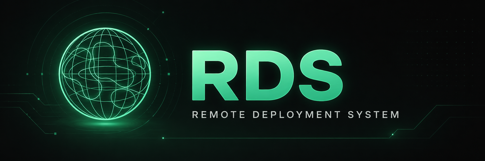
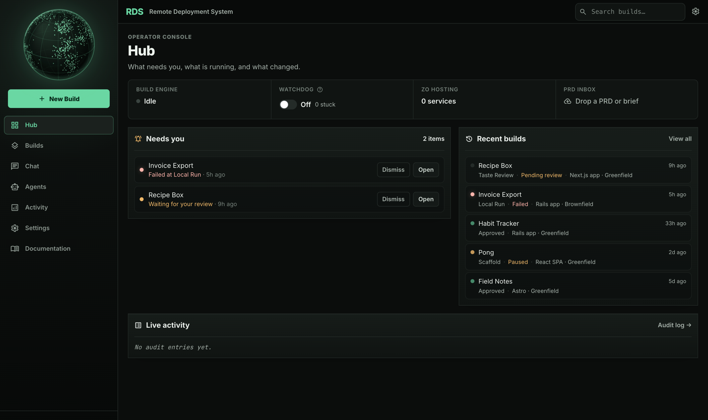
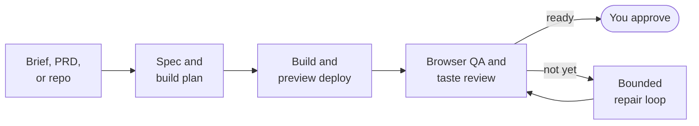
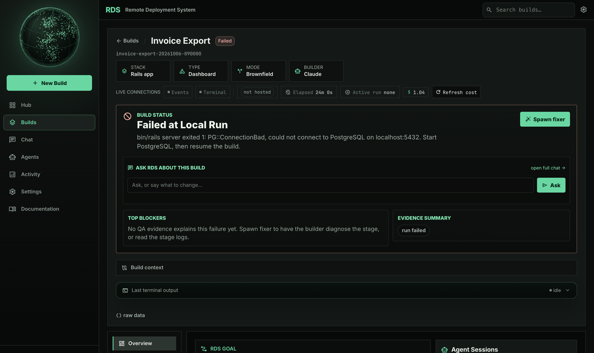

# RDS

<p align="center">
  
</p>

<p align="center">
  <strong>Your own server that turns a brief, PRD, or existing repo into a live website, with the evidence to judge it.</strong><br>
  RDS drives Claude Code or Codex to plan and build the app, runs browser QA and a taste review, repairs what it can, and publishes it at <code>https://&lt;build&gt;.your-domain</code> for your approval.
</p>

<p align="center">
  <a href="https://github.com/chrissotraidis/RDS/actions/workflows/public-checks.yml"></a>
  
  
  
  
  
  
  
  <a href="https://discord.gg/xwHfUD2bxW"></a>
</p>



> [!IMPORTANT]
> **RDS is early, single-operator software.** It is built for one trusted person
> on one always-on machine (a Linux VPS, a Zo computer, or similar). It is not a
> multi-user SaaS and not a stateless CI runner. Nothing merges, pushes, or gets
> approved without you.

## Get started

| You want to | Do this |
| --- | --- |
| **Look around the dashboard** on a Mac or Linux laptop | [Run the dashboard locally](#try-the-dashboard-locally). Needs only Bun; no models or server. |
| **Run it for real** on your own VPS | Follow [Install on a VPS](#install-on-a-vps) (about 20 minutes), then [start a build](#run-a-build). |
| **Understand the pipeline first** | Read [How it works](#how-it-works) and [docs/PIPELINE.md](docs/PIPELINE.md). |
| **Get help or report a bug** | Ask on [Discord](https://discord.gg/xwHfUD2bxW) or [open an issue](https://github.com/chrissotraidis/RDS/issues). |

### Try the dashboard locally

The dashboard runs anywhere Bun runs. A fresh clone starts in **setup mode**:
it answers only on `localhost` and shows a banner until you set credentials.

```bash
git clone https://github.com/chrissotraidis/RDS.git
cd RDS/dashboard
bun install
bun run dev
```

Open <http://localhost:4000>. A build is just a folder with a `state.json`, so
you can drop sample builds into `builds/` to see every state without running a
model. [docs/DASHBOARD.md](docs/DASHBOARD.md) has realistic examples.

### Install on a VPS

A VPS with a domain is the intended setup: RDS builds on the server and
publishes each passing build at its own HTTPS address. You need an Ubuntu 24.04
or Debian 12/13 server with systemd, a domain, and a Claude Code or Codex
account. The full walkthrough, including Postgres and Ruby for Rails builds, is
[docs/RUNNING_ON_A_VPS.md](docs/RUNNING_ON_A_VPS.md). In short:

1. **DNS.** Point `*.apps.example.com` and `rds.example.com` at the server.
2. **Packages (root).** Install Caddy, `git`, `curl`, `jq`, `rsync`, `python3`, and allow only ports 22, 80, and 443.
3. **RDS (as an `rds` user).** Install Bun and Claude Code or Codex and sign in, then:

   ```bash
   git clone https://github.com/chrissotraidis/RDS.git ~/RDS && cd ~/RDS
   cp .env.example .env && $EDITOR .env
   ./bootstrap/install.sh && ./bootstrap/verify.sh
   ```

   In `.env`, set the data paths, `RDS_DASHBOARD_PASSWORD`, `RDS_DASHBOARD_TOKEN`,
   `RDS_PUBLIC_DOMAIN=apps.example.com`, and `RDS_DASHBOARD_HOST=rds.example.com`.
4. **Wire it up (root).** This configures Caddy, installs the dashboard as a
   systemd service, and lets RDS keep published apps running across reboots:

   ```bash
   sudo ./bin/rds-vps-setup --user=rds --dry-run   # review
   sudo ./bin/rds-vps-setup --user=rds
   ```

5. **Check it.** As `rds`, `./bin/rds-vps-smoke` publishes a tiny app, verifies its HTTPS URL, and takes it offline. Then open `https://rds.example.com`, sign in, and start a build from **New Build**.

Running on a Zo computer instead? Leave `RDS_PUBLIC_DOMAIN` empty, set
`RDS_ZO_OWNER`, and follow [docs/RUNNING_ON_ZO.md](docs/RUNNING_ON_ZO.md).
The optional Arnold CLI adds richer codebase context; without it, `verify.sh`
reports it as missing and Wiki reads files directly.

### Run a build

Green-field, from a research note or PRD:

```bash
./bin/rds-start ./inbox/fixture-research.md \
  --app-dest="$HOME/projects/fixture" \
  --stack=rails-web --app-type=web-app
```

Brown-field, changing an existing repository:

```bash
./bin/rds-start \
  --repo=https://github.com/acme/foo.git --prd=./inbox/acme-prd.md \
  --app-dest="$HOME/projects/acme-foo" --branch=main \
  --stack=rails-web --app-type=dashboard
```

`rds-start` runs detached; use `./bin/rds-build` with the same arguments to
run in the foreground. Then watch it in the dashboard, or from the shell with
`./bin/rds-status <build-id>`. You can also start builds from the dashboard's
**New Build** page, which analyzes your brief and recommends a stack and skills
before anything runs.

## How it works


```mermaid
flowchart LR
  A["Brief, PRD,<br>or repo"] --> B["Spec and<br>build plan"]
  B --> C["Build and<br>preview deploy"]
  C --> D["Browser QA and<br>taste review"]
  D -- ready --> E(["You approve"])
  D -- not yet --> F["Bounded<br>repair loop"]
  F --> D
```

When a build passes, RDS publishes it. On a VPS the app runs as a systemd
service behind Caddy at `https://<build>.<your domain>`, and RDS checks that the
public URL serves the exact snapshot it just built before calling it live.
**Take offline** and **Publish** in the dashboard stop and restart it.

Long agent builds tend to fail the same ways: they drift from the original
intent, report success without proof, and overwrite the failure you needed to
see. RDS keeps the intent, the build state, and the evidence on disk, so each
build ends with a folder you can inspect rather than an agent saying it worked.

| Evidence | Where you find it |
| --- | --- |
| Source input and generated spec | Build folder, **Source files** on the build page |
| Build plan, stack, and skills | `state.json`, **Build context** |
| Stage logs and live terminal output | `logs/`, **Live Log** and **Logs** tabs |
| Browser QA, screenshots, and verdicts | QA artifacts, **Full QA evidence** |
| Preview URL and deploy record | `preview-url.txt`, deploy banner |
| Chat, actions, and approvals | Dashboard chat and the **Activity** audit log |

When a build is weak, **Goal Mode** keeps going for you within limits. It
refreshes the evidence, takes the smallest safe repair, and only escalates to
an isolated Claude Code or Codex worker once the normal loop is spent:

```bash
./bin/rds-goal <build-id> --objective="Make this build review-ready" \
  --max-cycles=12 --max-agent-reviews=2
```

It never merges, pushes, or approves. See [docs/AUTONOMY.md](docs/AUTONOMY.md).

## The dashboard



The dashboard is the operator console. Every screen answers three questions in
the same order: **what state the build is in, why, and the one next action.**
A failed build leads with the stage and the error line; a stopped runner leads
with **Resume build**; a build waiting on you leads with **Approve**. The full
design rules live in [docs/DESIGN.md](docs/DESIGN.md).

| Page | What it is for |
| --- | --- |
| **Hub** | What needs you (failures, stopped runners, reviews), system status, recent builds |
| **Builds** | Every build with filters for state, stack, mode, and hosting |
| **Build page** | Status, preview, logs, QA evidence, files, diff, and actions |
| **Chat** | Build-scoped requests that turn into confirmed actions |
| **Agents** | Claude Code and Codex worker sessions in isolated git worktrees |
| **Activity** | Append-only audit log of every write action |
| **Settings** | Builder defaults, stacks, skills, and runtime health |

## Frequently asked questions

<details>
<summary><strong>What can RDS build today?</strong></summary>

The strongest path is Rails-backed web apps and browser experiences. Stack
definitions also cover Next.js, React, Astro, React Native, browser
extensions, 3D web, game engines, Python AI services, and a game asset
pipeline, with a catalog of skills (auth, payments, search, deploy
targets, and more) that New Build selects from your brief. The catalog is
broader than what has been exercised end to end, so treat non-Rails stacks as
early. See [docs/STACKS_AND_SKILLS.md](docs/STACKS_AND_SKILLS.md).

</details>

<details>
<summary><strong>Is it safe to put the dashboard on the internet?</strong></summary>

Only with credentials set. RDS has its own Basic Auth gate on every route except
`/healthz`, and every write also needs the `X-RDS-Token` header to match
`RDS_DASHBOARD_TOKEN`. With no credentials it serves `localhost` only and
returns `503` to everything else. It is still a single-operator console, not a
permission system, and preview URLs are review artifacts rather than hardened
production deploys.

</details>

<details>
<summary><strong>Where does my data live, and what stays out of Git?</strong></summary>

The repository is public source; your runtime data is not. Builds, inbox
uploads, dashboard chat, events, settings, `.env`, logs, and generated apps are
all ignored. On a real host, point them outside the checkout:

```bash
RDS_BUILDS_DIR=/var/lib/rds/builds
RDS_INBOX_DIR=/var/lib/rds/inbox
RDS_EVENTS_PATH=/var/lib/rds/events.jsonl
RDS_DASHBOARD_CHAT_DIR=/var/lib/rds/dashboard-chat
RDS_DASHBOARD_STATE_DIR=/var/lib/rds/dashboard-state
```

Before publishing changes, `git ls-files builds inbox dashboard/chat` should
list only placeholders, READMEs, and committed fixtures. The full model is in
[docs/ARCHITECTURE.md](docs/ARCHITECTURE.md).

</details>

<details>
<summary><strong>How do published sites stay up, and how do I take one down?</strong></summary>

Each published build is a systemd service (`rds-app-<label>`) for the RDS
user, with `Restart=always` and lingering enabled, so it survives crashes,
logouts, and reboots. Caddy routes `<label>.<your domain>` to it and handles
certificates. **Take offline** on the build page (or
`bin/rds-vps-deregister --build-id=<id>`) stops the service and removes the
route; **Publish** puts it back. Apps run in development mode for fast review,
so treat them as previews rather than production deployments.

</details>

<details>
<summary><strong>Do I need both Claude Code and Codex?</strong></summary>

No. Either one is enough. You pick the default builder in **Settings**, and you
can switch provider or pin a model per build before continuing a goal or
iteration. Each build records the provider it started with.

</details>

<details>
<summary><strong>Does RDS pull the latest Wiki, Scaffold, or Rails starter at build time?</strong></summary>

No. Builds use the versions vendored in `vendor/`. Upgrades are imported and
verified on purpose; see [docs/COMPONENTS.md](docs/COMPONENTS.md).

</details>

<details>
<summary><strong>A build failed or stalled. What now?</strong></summary>

Open the build. The status card names the stage, shows the error, and offers
one action: **Spawn fixer** for a failure, **Resume build** when the runner
stopped, or **Continue RDS Goal** when evidence blocks approval. The
**Logs** tab has every stage log. [docs/TROUBLESHOOTING.md](docs/TROUBLESHOOTING.md)
covers the common cases, and [Discord](https://discord.gg/xwHfUD2bxW) is the
place to ask.

</details>

## Checks

```bash
./bootstrap/verify.sh --fresh-clone   # source-only check, before install
./bootstrap/verify.sh                 # installed host
./bin/rds-selftest                    # dashboard smoke test (Playwright)
./bin/rds-vps-smoke                   # on a VPS: publish and remove a test app
./bin/rds-quality-fixtures --keep-going
./bin/rds-autonomy-fixture
```

Run the fixture suites before changing QA, taste review, skill defaults, or
dashboard launch and review behavior. After changing dashboard markup or
tokens, regenerate the stylesheet with `bun run build:css` in `dashboard/`.

## Repository map

```text
rds/
├── AGENT.md      operator and agent playbook
├── bin/          orchestration scripts (rds-build, rds-goal, rds-status, ...)
├── bootstrap/    install and verification
├── dashboard/    Bun + Hono operator console
├── docs/         architecture, pipeline, design, operations
├── fixtures/     analyzer and QA regression fixtures
├── lib/          QA and agent runtime support
├── prompts/      spec, taste, and build prompts
├── skills/       skill registry and built-in skills
├── stacks/       runtime, build, and deploy profiles
└── vendor/       vendored Wiki, Scaffold, and Rails starter
```

## Documentation

Start at [docs/README.md](docs/README.md). The most used pages:

| Need | Read |
| --- | --- |
| Agent and operator protocol | [AGENT.md](AGENT.md) |
| Architecture and data boundary | [docs/ARCHITECTURE.md](docs/ARCHITECTURE.md) |
| Stage-by-stage pipeline | [docs/PIPELINE.md](docs/PIPELINE.md) |
| Dashboard pages and local development | [docs/DASHBOARD.md](docs/DASHBOARD.md) |
| Dashboard design rules | [docs/DESIGN.md](docs/DESIGN.md) |
| Goal Mode and Agent Sessions | [docs/AUTONOMY.md](docs/AUTONOMY.md) |
| VPS setup and publishing | [docs/RUNNING_ON_A_VPS.md](docs/RUNNING_ON_A_VPS.md) |
| Zo setup | [docs/RUNNING_ON_ZO.md](docs/RUNNING_ON_ZO.md) |
| Troubleshooting | [docs/TROUBLESHOOTING.md](docs/TROUBLESHOOTING.md) |
| Roadmap, contributing, security | [docs/PROJECT.md](docs/PROJECT.md) |

## Community and license

- **Discord:** [discord.gg/xwHfUD2bxW](https://discord.gg/xwHfUD2bxW), the same community as Chris's other projects. Questions, build reports, and ideas are welcome.
- **Issues:** [github.com/chrissotraidis/RDS/issues](https://github.com/chrissotraidis/RDS/issues)

RDS is released under the [MIT License](LICENSE). Vendored components keep
their own licenses; see [docs/COMPONENTS.md](docs/COMPONENTS.md).
