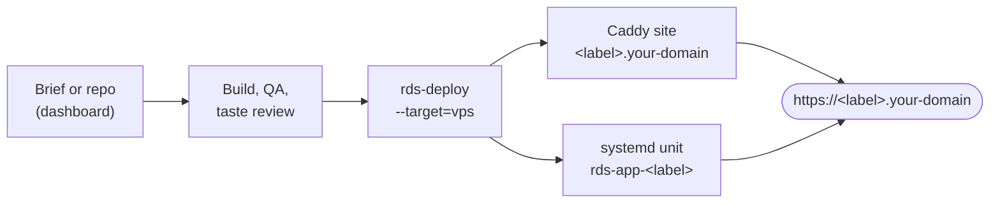

# Running RDS on a VPS

This is the main way to run RDS: one Linux server that takes a brief, has
Claude Code or Codex build the app, tests it, and publishes it at
`https://<build>.<your domain>` with a real certificate. You approve; RDS does
the rest.



## What you need

- A VPS running **Ubuntu 24.04 or Debian 12/13** with systemd. 2 vCPU and 4 GB
  RAM is a workable minimum; Rails builds are happier with 8 GB.
- A domain you control. You will point two DNS records at the server.
- A Claude Code or Codex account for the builder.

## 1. Point DNS at the server

Create these records (replace the IP and domain with yours):

| Type | Name | Value |
| --- | --- | --- |
| A | `*.apps.example.com` | your server's IP |
| A | `rds.example.com` | your server's IP |

Published builds live under the wildcard (`https://recipe-box-1a2b3c.apps.example.com`).
The dashboard lives at `rds.example.com`. Caddy gets a Let's Encrypt
certificate for each name the first time it is requested, so ports 80 and 443
must be reachable.

## 2. Install system packages (as root)

```bash
apt-get update
apt-get install -y git curl jq rsync python3 sudo unzip ufw \
  debian-keyring debian-archive-keyring apt-transport-https gnupg

# Caddy (https://caddyserver.com/docs/install#debian-ubuntu-raspbian)
curl -1sLf 'https://dl.cloudsmith.io/public/caddy/stable/gpg.key' | gpg --dearmor -o /usr/share/keyrings/caddy-stable-archive-keyring.gpg
curl -1sLf 'https://dl.cloudsmith.io/public/caddy/stable/debian.deb.txt' > /etc/apt/sources.list.d/caddy-stable.list
apt-get update && apt-get install -y caddy

# Firewall: SSH and web only. App ports (4000-4099) stay private behind Caddy.
ufw allow OpenSSH && ufw allow 80,443/tcp && ufw --force enable
```

Building Rails apps also needs PostgreSQL and Ruby 4.0.1+ with Bundler:

```bash
apt-get install -y postgresql
sudo -u postgres createuser --superuser rds   # published Rails apps connect over the local socket as rds
```

Install Ruby with your usual manager (mise, rbenv, or asdf) as the `rds` user
below. If you only build Node, static, or Python apps, skip Postgres and Ruby
and set `RDS_MANAGE_POSTGRES=0` in `.env`.

## 3. Create the RDS user and install RDS

```bash
adduser --disabled-password --gecos "" rds
su - rds
```

As `rds`:

```bash
curl -fsSL https://bun.sh/install | bash && exec $SHELL -l
npm i -g @openai/codex          # and/or: npm i -g @anthropic-ai/claude-code
codex login                     # or: claude   (sign in once)

git clone https://github.com/chrissotraidis/RDS.git ~/RDS
cd ~/RDS
cp .env.example .env
```

Edit `.env`. These are the values that matter for a VPS:

```bash
RDS_BUILDS_DIR=/home/rds/RDS/builds
RDS_INBOX_DIR=/home/rds/RDS/inbox
RDS_EVENTS_PATH=/home/rds/RDS/events.jsonl
RDS_DASHBOARD_CHAT_DIR=/home/rds/RDS/dashboard/chat
RDS_DASHBOARD_STATE_DIR=/home/rds/RDS/dashboard

RDS_DASHBOARD_PASSWORD=<long random password>
RDS_DASHBOARD_TOKEN=<long random token>

RDS_PUBLIC_DOMAIN=apps.example.com
RDS_DASHBOARD_HOST=rds.example.com
RDS_INFERENCE_PROVIDER=codex     # or claude

# Postgres from apt runs under systemd; let it manage itself.
RDS_MANAGE_POSTGRES=0
# Using a separate database server instead of the local socket? Set:
# RDS_DB_HOST=db.internal  RDS_DB_USERNAME=rails  RDS_DB_PASSWORD=...
```

Then:

```bash
./bootstrap/install.sh
./bootstrap/verify.sh
exit   # back to root
```

## 4. Wire up Caddy and the dashboard service (as root)

```bash
cd /home/rds/RDS
./bin/rds-vps-setup --user=rds --dry-run   # read what it will do
./bin/rds-vps-setup --user=rds
```

`rds-vps-setup` is idempotent. It:

1. checks for Caddy, systemd, Bun, a coding agent, the domain, and dashboard credentials;
2. creates `/etc/caddy/rds.d` (owned by `rds`) and adds `import /etc/caddy/rds.d/*.caddy` to `/etc/caddy/Caddyfile`;
3. publishes the dashboard at `https://$RDS_DASHBOARD_HOST`;
4. installs and starts `rds-dashboard.service`;
5. lets `rds` reload Caddy and keeps `rds`'s per-build services running after logout and reboot (`loginctl enable-linger`).

Open `https://rds.example.com`, sign in as `rds` with your dashboard password,
and start a build from **New Build**.

## How publishing works

When a build passes, `bin/rds-deploy` runs with `--target=vps` (the default
whenever `RDS_PUBLIC_DOMAIN` is set):

1. The app is copied to `builds/<id>/deploy-snapshot` and fingerprinted.
2. `bin/rds-vps-register` writes `builds/<id>/service-run.sh` and
   `service.env` from the stack manifest, then starts it as the systemd user
   unit `rds-app-<label>` with `Restart=always`.
3. It writes `/etc/caddy/rds.d/<label>.caddy` (`<label>.<domain>` →
   `127.0.0.1:<port>`) and reloads Caddy.
4. `rds-deploy` waits for the public URL and checks that it serves the exact
   snapshot it just deployed (`/.well-known/rds-deploy-fingerprint.json`).
5. `builds/<id>/service.json` records the result; the dashboard shows the build
   as **Live**.

**Take offline** in the dashboard (or `bin/rds-vps-deregister --build-id=<id>`)
stops and removes the unit, deletes the Caddy site, and marks the service
deregistered. **Publish** brings it back.

## Day-to-day

```bash
systemctl status rds-dashboard                 # dashboard + watchdog
journalctl -u rds-dashboard -f
sudo -u rds XDG_RUNTIME_DIR=/run/user/$(id -u rds) systemctl --user list-units 'rds-app-*'
tail -f /home/rds/RDS/builds/<id>/logs/service.log   # one app's output
ls /etc/caddy/rds.d                            # published sites
```

Update RDS:

```bash
su - rds -c 'cd ~/RDS && git pull && cd dashboard && bun install'
systemctl restart rds-dashboard
```

## Troubleshooting

<details>
<summary><strong>The dashboard or a build URL has no certificate</strong></summary>

Caddy requests a certificate the first time a name is visited. Check that DNS
for that name points at this server (`dig +short <name>`), that ports 80 and
443 are open, and read `journalctl -u caddy`. Let's Encrypt rate-limits
repeated failures, so fix DNS before retrying.

</details>

<details>
<summary><strong>502 Bad Gateway on a build URL</strong></summary>

Caddy is fine but the app is not answering. Read
`builds/<id>/logs/service.log`. A common cause is a tool missing from the
service `PATH`; RDS records the deploying user's `PATH` (plus `~/.bun/bin`,
`~/.local/bin`, `~/.cargo/bin`) in `builds/<id>/service.env`, so install
tools for the `rds` user and publish again.

</details>

<details>
<summary><strong>The dashboard keeps restarting</strong></summary>

`journalctl -u rds-dashboard` shows why. A missing Postgres only produces a
warning; set `RDS_MANAGE_POSTGRES=0` when Postgres runs under systemd or is not
needed. Make sure `bun install` has run in `dashboard/`.

</details>

<details>
<summary><strong>I use nginx or another proxy</strong></summary>

Set `RDS_VPS_PROXY=none` and route `*.<domain>` yourself: each build's
`service.json` records its `host` and `local_port`. You can also point
`RDS_CADDY_SITES_DIR` and `RDS_CADDY_RELOAD_CMD` at a different Caddy setup.

</details>

## Verification status

This path was verified end to end on Debian 13 with systemd as PID 1, Caddy
2.11, and Bun: `rds-vps-setup`, the dashboard over HTTPS with auth, publishing
a build as a systemd user unit behind Caddy, the deploy-fingerprint check,
**Take offline** and **Publish** from the dashboard, and a full reboot with the
dashboard and the published app coming back on their own. That run used Caddy's
local certificates for `*.localhost`; a first run on a cloud VPS with public
DNS and Let's Encrypt is the remaining real-world check.
